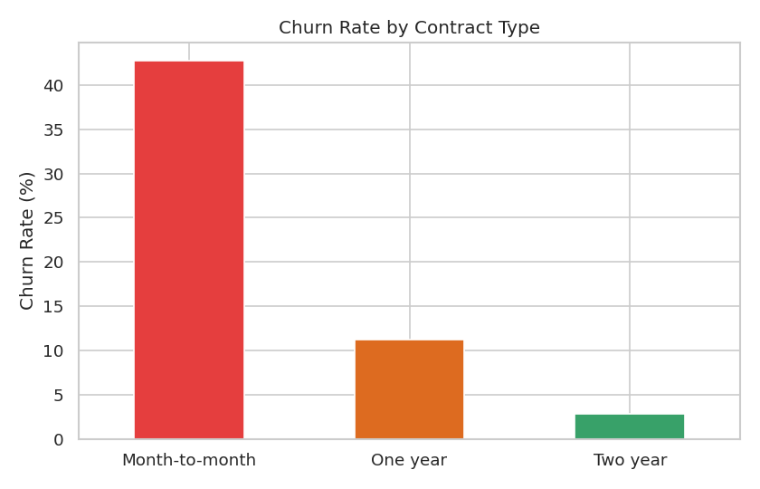
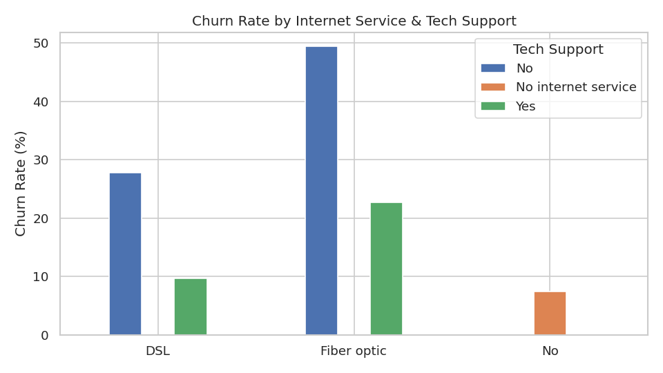
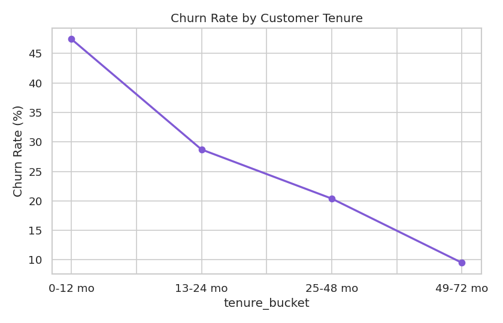
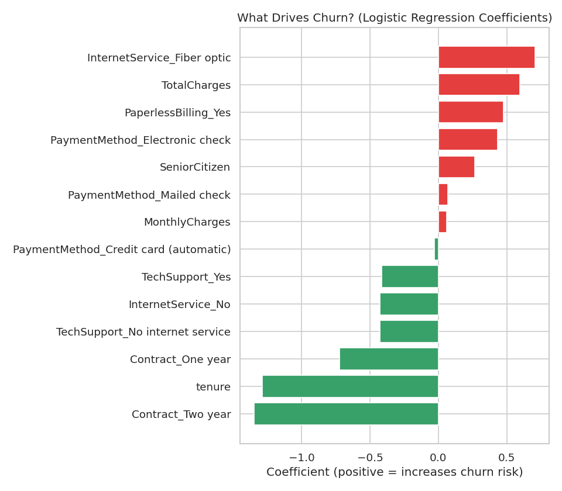

# Customer Churn Analysis: Who's About to Leave, and Why?

A Python project analyzing real customer data from a telecom company to predict churn and
turn that prediction into an actual "call these customers this week" list.

## The Business Question

A subscription business loses customers every month — that's normal. The real question is:
**can we tell, in advance, who's likely to leave, and is there a pattern we can act on before
they do?**

## Data

[IBM Telco Customer Churn Dataset](https://www.kaggle.com/datasets/blastchar/telco-customer-churn)
— 7,043 real customer records from a telecom provider, covering contract type, tenure,
monthly/total charges, internet service, tech support, payment method, and whether the
customer churned. Overall churn rate: **26.5%**.

**Data cleaning:** `TotalCharges` was stored as text instead of numbers in the raw file. On
investigation, 11 rows had a blank value instead of "0" — all of them customers with 0 months
of tenure, meaning they were brand new and hadn't been billed yet. These aren't errors; they
were converted to numeric and filled with 0 rather than dropped, since dropping them would have
removed real, valid new customers from the analysis.

## Tools Used

Python (pandas, matplotlib/seaborn for analysis and visualization, scikit-learn for the
predictive model).

## What I Found

### 1. Contract type is by far the biggest churn driver



Month-to-month customers churn at **42.7%**, compared to **11.3%** for one-year contracts and
just **2.8%** for two-year contracts. This is one of the clearest, most actionable patterns in
the data — contract length alone explains a massive amount of churn risk.

### 2. Fiber optic customers without tech support churn the most



Customers on fiber optic internet churn noticeably more than DSL customers, and having tech
support consistently lowers churn within each internet service type. This combination —
premium service without adequate support — appears to be a specific risk segment worth
investigating further (possibly pricing, reliability issues, or expectations mismatch).

### 3. Churn risk drops sharply as tenure increases



New customers churn far more than long-tenured ones, confirming that the first year is the
highest-risk window for this business.

### 4. A predictive model can flag at-risk customers before they leave

I built a logistic regression model using tenure, contract type, charges, internet service,
tech support, payment method, and demographic flags as inputs.

**Model performance:** ROC-AUC = **0.842** — a genuinely strong result for churn prediction,
without being unrealistically perfect (see `model_results.txt` for full precision/recall
detail; the model is notably better at catching customers who stay than customers who leave,
which is a real limitation worth being upfront about rather than glossing over).



The single strongest risk factor the model found was **Fiber optic internet service** — even
ahead of monthly charges. Longer contracts and longer tenure were the strongest factors
*reducing* churn risk, consistent with the EDA above.

### 5. Turning the model into something usable: a ranked at-risk list

Rather than stopping at "here's a model," I used it to generate `top_20_at_risk_customers.csv`
— a ranked list of currently active customers with the highest predicted churn probability.
This is the kind of deliverable a retention team could act on directly: call these customers
first.

## Recommendations

1. **Incentivize longer contracts**, especially at signup. The churn gap between month-to-month
   (42.7%) and two-year (2.8%) contracts is the single largest lever available — a modest
   discount for longer commitment would likely more than pay for itself in reduced churn.
2. **Investigate the fiber optic + no-tech-support segment specifically.** Since this
   combination churns at an especially high rate, it's worth understanding whether this is a
   pricing issue, a reliability issue, or simply customers who'd benefit from being proactively
   offered tech support.
3. **Front-load retention effort into the first 12 months.** This is where churn risk is
   highest, and where an early intervention has the most leverage.
4. **Use the churn risk score to prioritize retention outreach**, rather than treating all
   customers the same. The ranked at-risk list turns "some customers might be unhappy" into a
   concrete, prioritized action list.

## Project Structure

```
customer-churn-analysis/
├── WA_Fn-UseC_-Telco-Customer-Churn.csv
├── analysis.py
├── model_results.txt
├── top_20_at_risk_customers.csv
    ├── 01_churn_by_contract.png
    ├── 02_churn_by_internet_support.png
    ├── 03_churn_by_tenure.png
    ├── 04_roc_curve.png
    └── 05_feature_importance.png
```

## Resume Version

> Built a customer churn prediction model in Python (pandas, scikit-learn) on 7,043 real
> telecom customer records, achieving 0.84 ROC-AUC; identified contract type and fiber optic
> service as the strongest churn drivers, and generated a ranked at-risk customer list to guide
> retention outreach.
